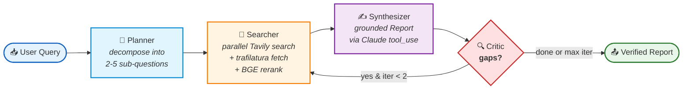

<div align="center">

# 🔬 Deep Research Agent

### Agentic research where every claim is bound to a source — at the type-system level.

*Pydantic v2 rejects ungrounded claims before they reach the user. Hallucinated citations cannot exist in this codebase.*

[](https://www.python.org)
[](https://github.com/langchain-ai/langgraph)
[](https://www.anthropic.com)
[](https://modelcontextprotocol.io)
[](LICENSE)

[]()
[](https://github.com/astral-sh/ruff)
[]()
[](https://mypy.readthedocs.io)
[](docs/adr/)

**[Architecture](#%EF%B8%8F-architecture)** ·
**[Quick Start](#-quick-start-60-seconds)** ·
**[Three Interfaces](#-three-interfaces)** ·
**[Reliability](#%EF%B8%8F-reliability-engineering)** ·
**[Decisions](#-architecture-decision-records)** ·
**[Roadmap](#%EF%B8%8F-roadmap)**

</div>

---

## 🎯 The Problem

LLM research tools — Perplexity, ChatGPT browse, You.com — return citations that *look* trustworthy. Links appear next to text. But the binding between a specific claim and a specific source passage is enforced by **prompt instruction only**. When the LLM hallucinates a citation or quotes a passage that doesn't actually support the claim, there is no system-level mechanism to catch it. Verification falls back to the user, which defeats the point of automated research.

## 💡 The Solution

This project enforces grounding in the **type system**, not in the prompt:

```python
class Claim(BaseModel):
    text: str = Field(min_length=5, max_length=1000)
    source_ids: list[str] = Field(min_length=1)  # ← cannot be empty
    confidence: float = Field(ge=0.0, le=1.0)

    @field_validator("source_ids")
    @classmethod
    def validate_format(cls, v: list[str]) -> list[str]:
        for sid in v:
            if not sid.startswith("src_"):
                raise ValueError(f"invalid source_id: {sid!r}")
        return v
```

A `Claim` cannot exist without source IDs. `Report.validate_grounding()` runs after every synthesizer call and **drops** any claim citing a source that isn't in the actual sources list. Hallucinated attributions are filtered automatically — not asked-about-nicely-in-a-prompt. The contract is in code, and the code is the documentation.

---

## 🏗️ Architecture

A four-node LangGraph state machine with a bounded critic loop (max 2 iterations).



### Node Responsibilities

| Node | Input | Output | LLM | Why it exists |
|---|---|---|---|---|
| **Planner** | User query | 2–5 `SubQuestion` objects | Claude Sonnet 4.5 (forced tool-use) | Single-shot research is brittle. Decomposition surfaces orthogonal angles. |
| **Searcher** | Sub-questions | Top-K reranked chunks + sources | — (no LLM) | Embarrassingly parallel via `asyncio.gather`. BGE-reranker beats raw embedding similarity for relevance. |
| **Synthesizer** | Query + chunks + sources | `Report` (claims + summary) | Claude Sonnet 4.5 | The citation contract is enforced here. `validate_grounding()` drops ghost citations. |
| **Critic** | Draft report | Loop-back signal or `done` | Claude Sonnet 4.5 | Single feedback loop in the system. Bounded at `MAX_ITERATIONS=2` so worst-case latency is finite. |

### Why these four, not more or fewer

More nodes = more failure modes and longer critical path. Fewer nodes = no separation of concerns, citation enforcement gets entangled with retrieval logic. The four-node split mirrors how a human research analyst actually works: **plan → gather → write → review**. Each node is a pure async function over `ResearchState` (TypedDict), which makes them unit-testable in isolation without mocking the entire graph.

---

## ⚡ Quick Start (60 seconds)

> **Prerequisites:** Python 3.12+, [`uv`](https://github.com/astral-sh/uv), Anthropic API key, Tavily API key (1000 req/mo free tier).

```bash
# 1. Clone
git clone https://github.com/jakkapat-kingthong/deep-research-agent.git
cd deep-research-agent

# 2. Install (uv handles venv + lockfile resolution in ~10s)
uv sync --extra dev --extra eval

# 3. Configure
cp .env.example .env && $EDITOR .env   # fill ANTHROPIC_API_KEY, TAVILY_API_KEY

# 4. Ask a research question
uv run research ask "What are the differences between LangGraph and CrewAI for production agents?"
```

You'll see streaming logs as each node executes:

```text
2026-05-04 14:22:01 | INFO  | Planner: decomposing query
2026-05-04 14:22:03 | INFO  | Planner: generated 4 sub-questions
2026-05-04 14:22:03 | INFO  |   1. How does LangGraph handle stateful agent workflows?
2026-05-04 14:22:03 | INFO  |   2. What multi-agent coordination patterns does CrewAI offer?
2026-05-04 14:22:03 | INFO  |   3. How do production deployments compare?
2026-05-04 14:22:03 | INFO  |   4. What are the key API design differences?
2026-05-04 14:22:08 | INFO  | Searcher: 18 unique URLs to fetch
2026-05-04 14:22:14 | INFO  | Searcher: 14 articles, 89 chunks, reranked to top-20
2026-05-04 14:22:23 | INFO  | Synthesizer: 6 claims, all grounded ✓
2026-05-04 14:22:25 | INFO  | Critic: report adequate, terminating
```

---

## 🔌 Three Interfaces

The same agent core (`src/deep_research/graph.py`) is exposed through three entry points. Same logic, three protocols.

<details>
<summary><b>1. CLI</b> — fastest local testing (typer + rich)</summary>

```bash
uv run research ask "your question" --budget 0.30
```

State checkpointed in memory via `MemorySaver`. Pretty-printed report with Rich. Best for iteration during development.

</details>

<details>
<summary><b>2. REST API</b> — FastAPI with SSE streaming</summary>

```bash
uv run uvicorn api.main:app --port 8000
```

```bash
# Streaming endpoint — emits node updates as they happen
curl -N -X POST http://localhost:8000/v1/research \
  -H "Content-Type: application/json" \
  -d '{"query": "What is MCP?", "budget_usd": 0.30}'
```

```bash
# Sync endpoint — returns full report
curl -X POST http://localhost:8000/v1/research/sync \
  -H "Content-Type: application/json" \
  -d '{"query": "What is MCP?", "budget_usd": 0.30}'
```

| Endpoint | Method | Purpose |
|---|---|---|
| `GET /healthz` | GET | Health check (used by Docker healthcheck) |
| `POST /v1/research` | POST | SSE streaming — emits `node_update` events |
| `POST /v1/research/sync` | POST | Blocking — returns complete `Report` JSON |
| `GET /docs` | GET | OpenAPI / Swagger UI |

OpenTelemetry instrumented via `opentelemetry-instrumentation-fastapi`. Default exporter is console; swap for OTLP in production.

</details>

<details>
<summary><b>3. MCP Server</b> — Claude Desktop / Cursor / any MCP client</summary>

The differentiator. Exposes the agent as a tool any MCP-compatible AI assistant can call.

Add to `claude_desktop_config.json`:

```json
{
  "mcpServers": {
    "deep-research": {
      "command": "uv",
      "args": [
        "--directory",
        "/absolute/path/to/deep-research-agent",
        "run",
        "python",
        "-m",
        "mcp_server.server"
      ]
    }
  }
}
```

Restart Claude Desktop. Open a new chat. Claude now has a `research` tool — ask it to research anything and it'll call this agent under the hood, returning a verified report with citations.

The MCP server is ~30 lines of Python (FastMCP). The graph is identical to REST and CLI — same code path, three protocols.

</details>

---

## 🛠️ Reliability Engineering

> *Building agents is mostly debugging the LLM provider, not designing the graph.*

This section documents real failure modes encountered during development and the layered defenses that handle each.

### Layer 1 — Schema-enforced grounding (the type system)

`Claim.source_ids` has `min_length=1`. A claim with no sources cannot be parsed. Beyond that, `Report.validate_grounding()` cross-checks every cited `source_id` against the actual sources list and drops claims that reference IDs the LLM invented:

```python
def validate_grounding(self) -> list[str]:
    """Return source_ids cited but not in sources list."""
    available = {s.source_id for s in self.sources}
    missing: set[str] = set()
    for claim in self.claims:
        for sid in claim.source_ids:
            if sid not in available:
                missing.add(sid)
    return sorted(missing)
```

This runs unconditionally after every synthesizer call. The LLM's confidence score doesn't matter — if the source ID isn't in the sources list, the claim is dropped.

### Layer 2 — Exponential backoff on LLM format drift

**The failure mode:** Llama 3 on Groq, even with strict tool-use schemas, occasionally returns output in legacy XML-like function-call format (`<function=submit_response> {...}`) instead of a proper `tool_use` content block. Anthropic's API returns 400 `tool_use_failed` when the prompt is too broad relative to the schema's complexity. Either failure aborts the run.

**The mitigation in `src/deep_research/llm/groq_llm.py`:**

| Attempt | Wait | Strategy |
|---|---|---|
| 1 | — | Initial call with full system prompt + user query |
| 2 | 1s | Retry with parse error appended to user message: *"Your previous response failed validation: <error>. Return only the tool_use block matching the schema."* |
| 3 | 2s | Retry with simplified user message — strip optional context, list only required fields |
| 4 | 4s | Final retry with minimal prompt; if still failing, raise to caller |

The feedback loop is the key — each retry tells the model what went wrong, so it self-corrects rather than rolling the same dice.

### Layer 3 — Multi-provider fallback via Protocol

```python
# src/deep_research/llm/base.py
class LLMProvider(Protocol):
    async def structured_complete(
        self, *, system: str, user: str,
        response_model: type[T], max_tokens: int = 2048,
    ) -> tuple[T, int, int]: ...
```

| Provider | Role | Why |
|---|---|---|
| **Anthropic Claude Sonnet 4.5** | Primary | Highest tool-use compliance; `tool_choice` forced output |
| **Groq / Llama 3.3 70B** | Backup, cost-sensitive nodes | ~20× cheaper than Claude; great for the critic node |
| **Google Gemini 2.5 Flash** | Wired, not active | Reserved for low-stakes / high-volume use cases |

Provider swap is a one-line change. Each implements the same `LLMProvider` Protocol, so nodes don't know or care which provider they're talking to.

### Layer 4 — Bounded critic loop + budget caps

```python
MAX_ITERATIONS = 2  # nodes/critic.py

if state.get("iteration", 0) >= MAX_ITERATIONS:
    return {"critic_feedback": "max_iterations"}
```

`budget_usd` is checked before every LLM call. Exceeded → node returns partial result rather than burning more credits chasing a malformed output. Worst-case end-to-end latency is bounded to `2 × (search + synth + critic)`.

### Layer 5 — Observability

Structured logging via `loguru` (JSON in production via `LOG_LEVEL=INFO`). Distributed tracing via `opentelemetry-sdk` — every node call, every LLM call, every search call is a span with attributes for `tokens_in`, `tokens_out`, `cost_usd`, `latency_ms`. When something breaks at 3am, the trace tells you which node, which provider, which call.

---

## 📊 Evaluation

A 20-case benchmark dataset lives in `eval/dataset.jsonl`, covering AI/ML research questions across LLM systems, RAG, agents, edge AI, and tooling. Custom metrics in `eval/metrics.py`:

| Metric | Formula | What it catches |
|---|---|---|
| **Citation Accuracy** | `valid_claims / total_claims` | Hallucinated source IDs |
| **Keyword Coverage** | `expected_kw_present / total_expected_kw` | Off-topic answers |
| **Min-claims threshold** | `len(claims) >= case.min_claims` | Underspecified responses |
| **Mean Latency (p50, p95)** | per-case `time.perf_counter()` | Performance regressions |
| **Mean Cost / Query** | sum of token costs across all nodes | Budget drift |

```bash
# Run the full benchmark suite
uv run python -m eval.run_eval

# Pytest-runnable smoke subset (5 cases, with regression thresholds)
uv run pytest tests/eval -v
```

> **Status:** Benchmark suite is implemented and runnable. **Numbers will be published in [`eval/latest_report.json`](eval/) once the first full run completes.** This README will not display fabricated metrics — measured numbers only. The pytest smoke harness already enforces `citation_accuracy >= 0.70` as a CI gate.

---

## 📐 Architecture Decision Records

Engineering tradeoffs are documented in [`docs/adr/`](docs/adr/) rather than buried in commit messages. Seven ADRs cover the load-bearing decisions.

| # | Title | Core argument |
|---|---|---|
| [001](docs/adr/001-docker-and-deployment.md) | **Docker & Deployment** | CLI Docker over Desktop, `--no-cache` rules, why `curl` for health checks |
| [002](docs/adr/002-langgraph-orchestration.md) | **LangGraph for Orchestration** | Stateful graph + bounded loops + checkpointing vs. CrewAI / AutoGen / custom asyncio |
| [003](docs/adr/003-mcp-integration.md) | **Expose as MCP Server** | Why triple interface; MCP as the demo killer feature |
| [004](docs/adr/004-pydantic-citation-contracts.md) | **Schema-Enforced Citations** ⭐ | Why type-system enforcement beats prompt instructions for grounding |
| [005](docs/adr/005-skip-vector-db.md) | **Skip Vector DB** | Why <1k chunks/session doesn't justify Qdrant/Pinecone overhead |
| [006](docs/adr/006-anthropic-primary-llm.md) | **Anthropic Primary LLM** | `tool_choice` forced output vs. json_mode vs. instructor library |
| [007](docs/adr/007-docker-deployment-lessons.md) | **Docker Debugging Lessons** | Four real production issues from deployment day + fixes |

> 💡 **Read [ADR-004](docs/adr/004-pydantic-citation-contracts.md) first.** It's the technical core of why this project exists.

Each ADR follows the standard format: **Context → Options Considered (table) → Decision → Implementation → Consequences**. New decisions get new ADRs; superseded ones are marked but not deleted.

---

## 📁 Project Structure

```text
deep-research-agent/
├── src/deep_research/
│   ├── state.py              # TypedDict ResearchState — single source of truth
│   ├── graph.py              # LangGraph StateGraph wiring + conditional edges
│   ├── schemas.py            # pydantic v2: Claim, Source, Report, PlannerOutput
│   ├── config.py             # pydantic-settings — env var validation
│   ├── observability.py      # OpenTelemetry tracer setup
│   ├── nodes/
│   │   ├── planner.py        # query → SubQuestion list (Claude tool_use)
│   │   ├── searcher.py       # parallel search + fetch + chunk + rerank
│   │   ├── synthesizer.py    # chunks → grounded Report, drops ghost citations
│   │   └── critic.py         # bounded self-critique, max 2 iterations
│   ├── tools/
│   │   ├── search.py         # Tavily primary + DDG fallback
│   │   ├── fetch.py          # httpx.AsyncClient + trafilatura extraction
│   │   └── rerank.py         # BGE-reranker-base cross-encoder
│   └── llm/
│       ├── base.py           # LLMProvider Protocol — provider-agnostic
│       ├── anthropic_llm.py  # Claude with forced tool_choice
│       └── groq_llm.py       # Llama 3 with exponential backoff
├── api/main.py               # FastAPI + SSE streaming + OTel
├── mcp_server/server.py      # FastMCP server (~30 lines)
├── eval/
│   ├── dataset.jsonl         # 20-case benchmark
│   ├── metrics.py            # CitationAccuracy, KeywordCoverage, etc.
│   └── run_eval.py           # benchmark runner with rich table output
├── tests/
│   ├── unit/                 # pure logic, no network — fast
│   ├── integration/          # real Tavily + real URLs
│   └── eval/                 # pytest-runnable benchmark smoke
├── deploy/
│   ├── Dockerfile            # multi-stage with reranker pre-download
│   └── docker-compose.yml    # local dev with health checks
└── docs/adr/                 # 7 architecture decision records
```

---

## 🧪 Tech Stack Decisions

<details>
<summary><b>Click to expand the full stack rationale</b></summary>

| Layer | Choice | Alternatives Rejected | Why |
|---|---|---|---|
| **Package mgmt** | `uv` | Poetry, pip-tools | ~10× faster than poetry; lockfile-first |
| **Type system** | `pydantic v2` + `from __future__ import annotations` | dataclasses, attrs | Validation at boundaries; v2 is Rust-backed and fast |
| **Orchestration** | LangGraph | CrewAI, AutoGen, custom asyncio | Bounded loops, checkpointing, explicit state — see ADR-002 |
| **LLM (primary)** | Claude Sonnet 4.5 | GPT-4o, Gemini Flash | Best tool-use compliance with `tool_choice` forcing |
| **LLM (backup)** | Groq / Llama 3.3 70B | Mistral, Cohere | ~20× cheaper for low-stakes nodes |
| **Search** | Tavily | Serper, Brave Search, SerpAPI | AI-optimized snippets; 1000 req/mo free |
| **Search fallback** | DuckDuckGo | None | Zero-config emergency fallback |
| **Web extraction** | trafilatura | BeautifulSoup, readability | Best-in-class for article-text extraction |
| **Reranker** | BGE-reranker-base | Cohere Rerank, ColBERT | Cross-encoder beats embedding similarity for reranking |
| **Vector DB** | None | Qdrant, ChromaDB, FAISS | <1k chunks/session — see ADR-005 |
| **API server** | FastAPI + SSE | Flask, Sanic, raw asyncio | Async-native; OpenAPI built-in |
| **MCP server** | FastMCP | Custom MCP impl | ~30 lines vs. ~300 |
| **Observability** | loguru + OpenTelemetry | stdlib logging, structlog | JSON-native; OTel is the standard |
| **Linter / formatter** | ruff | black + isort + flake8 | One tool, ~100× faster |

</details>

---

## 🛣️ Roadmap

**Pre-deployment audit** (completed)
- [x] Pydantic v2 strict mode across all schemas
- [x] `from __future__ import annotations` consistency
- [x] Async-correctness audit (no sync I/O in async functions)
- [x] Hardcoded secret removal + env var validation
- [x] 20-case benchmark dataset compiled
- [x] 7 ADRs written

**Day 7 — Deployment** (in progress)
- [ ] Modal serverless deployment
- [ ] Hugging Face Space (Gradio UI calling Modal API)
- [ ] First full eval run + published metrics
- [ ] 3-minute demo video
- [ ] LinkedIn post + resume update

**v0.2 — Research scope expansion**
- [ ] **Thai-language research** — WangchanBERTa tokenizer for query rewrite, Thai-language search providers
- [ ] **PDF ingestion** — research over uploaded papers (would justify FAISS; see ADR-005 reconsideration trigger)
- [ ] **Chrome extension** — highlight text on any page → trigger research

**v0.3 — Production hardening**
- [ ] Cost-tier routing — auto-select Gemini Flash for low-stakes nodes when budget is tight
- [ ] Persistent state — Redis-backed checkpointer for resumable long-running research
- [ ] Multi-tenant rate limiting

---

## 🤝 Contributing

Issues and PRs welcome. Before submitting:

```bash
uv run ruff check . --fix && uv run ruff format .
uv run pytest tests/unit -v
uv run mypy src/
```

PRs that change architecture should reference an ADR. New decisions get a new ADR — template in [`docs/adr/001-docker-and-deployment.md`](docs/adr/).

---

## 📄 License

[MIT](LICENSE) © 2026 Jakkapat Kingthong

---

<div align="center">

## 👤 Author

**Jakkapat Kingthong**
*AI Engineer · CV + Edge AI + LLM Orchestration*

B.Eng. Computer & Robotics Engineering, Bangkok University
🏆 **Google Student Ambassador** 2025–present
🥉 **Top 3 Finalist** — Securing Digital Trust Anti-Scam Ideathon (Mar 2026)

**Open to AI Engineering Co-op opportunities — June 2026, 6-month duration.**

[](mailto:jakkapat.potae@gmail.com)
[](https://github.com/jakkapat-kingthong)

⭐ **Star this repo** if you find the schema-enforced citation approach interesting.

</div>
